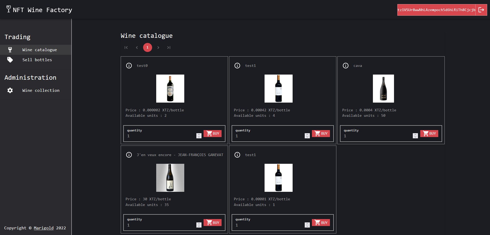
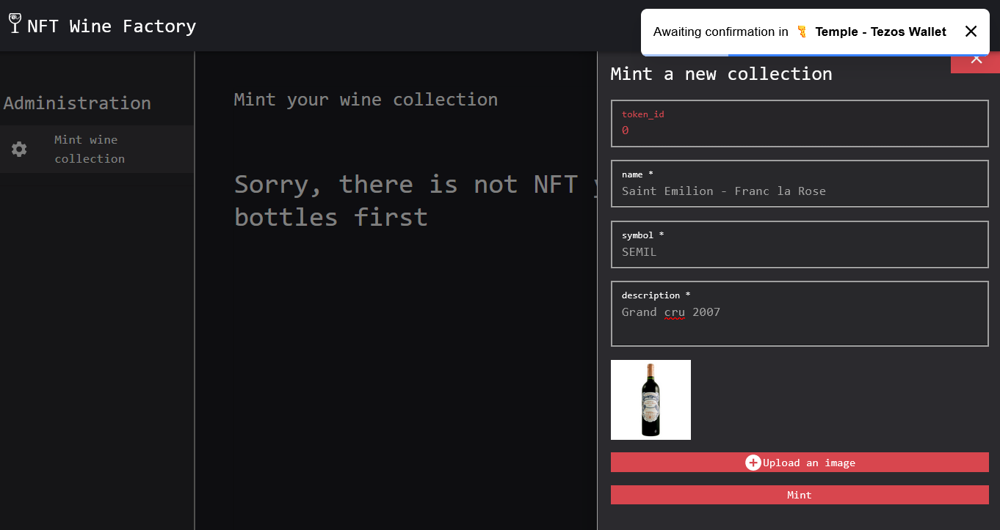
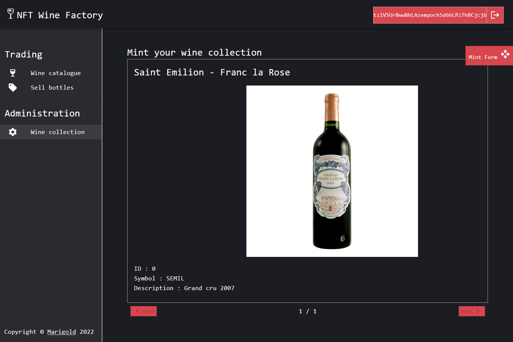

# training-nft-1

Training n°1 for NFT marketplace

Introduction : Business objects managed by a blockchain are called `assets`. On Tezos you will find the term `Financial Asset or FA` with different version 1, 2 or 2.1.
Here below different categorization of assets.


# :wine_glass: Wine marketplace

We are going to build a Wine marketplace.
You can play with the final demo here : [https://demo.winefactory.marigold.dev/](https://demo.winefactory.marigold.dev/)



Plan of the training course :

- [NFT 1](https://github.com/marigold-dev/training-nft-1) : use FA2 nft template to understand the basics
- [NFT 2](https://github.com/marigold-dev/training-nft-2) : finish FA2 nft marketplace
- [NFT 3](https://github.com/marigold-dev/training-nft-3) : use FA2 single asset template to build another kind of marketplace
- [NFT 4](https://github.com/marigold-dev/training-nft-4) : use FA2 multi asset template to build last complex kind of marketplace

| Token template | # of token_type | # of item per token_type |
| -------------- | --------------- | ------------------------ |
| nft            | 0..n            | 1                        |
| single asset   | 0..1            | 1..n                     |
| multi asset    | 0..n            | 1..n                     |


## :performing_arts: What are NFTs?

A non-fungible token is a unique and non-interchangeable unit of data stored on a digital ledger. NFTs can be used to represent easily-reproducible items such as photos, videos, audio, and other types of digital files as unique items, and use blockchain technology to establish a verified and public proof of ownership.

## :open_file_folder: What is IPFS?

The InterPlanetary File System is a protocol and peer-to-peer network for storing and sharing data in a distributed file system. IPFS uses content-addressing to uniquely identify each file in a global namespace connecting all computing devices. In this tutorial, we will be using [pinata](https://www.pinata.cloud/) (free developer plan) to store the metadata for NFTs. An alternative would be to install a local IPFS node or an API gateway backend with usage quota.

## :scroll: Smart Contracts

We will use two contracts for the marketplace. First will be the token contract. On Tezos FA2 is the standard for Non-fungible Token contracts. We will be using the [template provided by Ligo](https://packages.ligolang.org/package/@ligo/fa) to build out the Token Contract. The template contains the basic entry points for building a Fungible or Non-fungible token including

- Transfer
- Balance_of
- Update_operators

On a second time, we will import this contract into a second one that will be the marketplace unique contract. This contract will bring missing feature as :

- Mint
- Buy
- Sell

# :memo: Prerequisites

Please install this software first on your machine :

- [ ] (Recommended) [VS Code](https://code.visualstudio.com/download) : as text editor
- [ ] [npm](https://nodejs.org/en/download/) : we will use a typescript React client app
- [ ] (Recommended) [yarn](https://classic.yarnpkg.com/lang/en/docs/install/#windows-stable) : because yet another package manager (https://www.geeksforgeeks.org/difference-between-npm-and-yarn/)
- [ ] [taqueria](https://github.com/ecadlabs/taqueria) : Tezos Dapp project tooling (version >= 0.24.2)
- [ ] (Optional) [taqueria VS Code extension](https://marketplace.visualstudio.com/items?itemName=ecadlabs.taqueria-vscode) : visualize your project and execute tasks
- [ ] (Recommended) [ligo VS Code extension](https://marketplace.visualstudio.com/items?itemName=ligolang-publish.ligo-vscode) : for smart contract highlighting, completion, etc ..
- [ ] (Recommended) [Temple wallet](https://templewallet.com/) : an easy to use Tezos wallet in your browser (Or any other one with ghostnet support)
- [ ] [Docker](https://docs.docker.com/engine/install/) Taqueria works with Docker running
- [ ] [jq](https://stedolan.github.io/jq/download/) To be able to extract taqueria json data

# :scroll: Smart contract

We will use taqueria to shape the project structure, then create the nft marketplace contract importing the `ligo/fa` libray

## Taq'ify your project

```bash
taq init training
cd training
taq install @taqueria/plugin-ligo
```

> :warning: HACK note : create a dummy esy.json file with `{}` content on it. I will be used by the ligo package installer to not override the default package.json file of taqueria

```bash
echo "{}" > esy.json
```

Your project is ready

## FA2 contract

We will rely on Ligo FA library. To understand in detail how works asset on Tezos, please read below notes

> Note : FA2 standard can be found here => [https://gitlab.com/tezos/tzip/-/blob/master/proposals/tzip-12/tzip-12.md](https://gitlab.com/tezos/tzip/-/blob/master/proposals/tzip-12/tzip-12.md)
> Additional contract metadata can be added to easier display token picture,etc ... this is describe on TZIP-21 standard here [https://gitlab.com/tezos/tzip/-/blob/master/proposals/tzip-21/tzip-21.md](https://gitlab.com/tezos/tzip/-/blob/master/proposals/tzip-21/tzip-21.md)

> Note : Generic Contract metadata reference => [https://gitlab.com/tezos/tzip/-/blob/master/proposals/tzip-16/tzip-16.md](https://gitlab.com/tezos/tzip/-/blob/master/proposals/tzip-16/tzip-16.md)

Install the ligo fa library locally

```bash
TAQ_LIGO_IMAGE=ligolang/ligo:0.57.0 taq ligo --command "install @ligo/fa"
```

## NFT marketplace contract

Create the nft marketplace contract with taqueria

```bash
taq create contract nft.jsligo
```

Remove the default code and paste this code instead

```jsligo
#import "@ligo/fa/lib/fa2/nft/NFT.jsligo" "NFT"

/* ERROR MAP FOR UI DISPLAY or TESTS
    const errorMap : map<string,string> = Map.literal(list([
      ["0", "Enter a positive and not null amount"],
      ["1", "Operation not allowed, you need to be administrator"],
      ["2", "You cannot sell more than your current balance"],
      ["3", "Cannot find the offer you entered for buying"],
      ["4", "You entered a quantity to buy than is more than the offer quantity"],
      ["5", "Not enough funds, you need to pay at least quantity * offer price to get the tokens"],
      ["6", "Cannot find the contract relative to implicit address"],
    ]));
*/

type storage =
  {
    administrators: set<address>,
    ledger: NFT.Ledger.t,
    metadata: NFT.Metadata.t,
    token_metadata: NFT.TokenMetadata.t,
    operators: NFT.Operators.t,
    token_ids : set<NFT.Storage.token_id>
  };

type ret = [list<operation>, storage];

type parameter =
  | ["Mint", nat,bytes,bytes,bytes,bytes] //token_id, name , description  ,symbol , ipfsUrl
  | ["AddAdministrator" , address]
  | ["Transfer", NFT.transfer]
  | ["Balance_of", NFT.balance_of]
  | ["Update_operators", NFT.update_operators];


const main = ([p, s]: [parameter,storage]): ret =>
    match(p, {
     Mint: (p: [nat,bytes,bytes,bytes,bytes]) => [list([]),s],
     AddAdministrator : (p : address) => {if(Set.mem(Tezos.get_sender(), s.administrators)){ return [list([]),{...s,administrators:Set.add(p, s.administrators)}]} else {return failwith("1");}} ,
     Transfer: (p: NFT.transfer) => [list([]),s],
     Balance_of: (p: NFT.balance_of) => [list([]),s],
     Update_operators: (p: NFT.update_operator) => [list([]),s],
     });
```

Explanations :

- the first line `#import "@ligo/fa/lib/fa2/nft/NFT.jsligo" "NFT"` imports the ligo FA library
- `storage` definition is an extension of the imported library storage `(NFT.Ledger.t,NFT.Metadata.t,NFT.TokenMetadata.t,NFT.Operators.t,set<NFT.Storage.token_id>)`
- `storage` has more fields to support a set of `administrators`
- `parameter` definition is an extension of the imported library entrypoints `(NFT.transfer,NFT.balance_of,NFT.update_operators)`
- `parameter` has more entrypoints to allow to create nfts `Mint`
- `parameter` has an entrypoint `AddAdministrator`to add new administrators

Compile the contract

```bash
TAQ_LIGO_IMAGE=ligolang/ligo:0.57.0 taq compile nft.jsligo
```

> Note : to be sure that taqueria will use ligo v0.57 that contains the ligo package installer w/ Docker fix, we set the env var `TAQ_LIGO_IMAGE`

The contract compiles, now let's write `Transfer,Balance_of,Update_operators` entrypoints. We will do a passthrough call to the underlying library. On `main` function, **replace the default cases code by this one**

```jsligo
     Transfer: (p: NFT.transfer) => {
      const ret2 : [list<operation>, NFT.storage] = NFT.transfer(p,{ledger:s.ledger,metadata:s.metadata,token_metadata:s.token_metadata,operators:s.operators,token_ids : s.token_ids});
      return [ret2[0],{...s,ledger:ret2[1].ledger,metadata:ret2[1].metadata,token_metadata:ret2[1].token_metadata,operators:ret2[1].operators,token_ids:ret2[1].token_ids}];
     },
     Balance_of: (p: NFT.balance_of) => {
      const ret2 : [list<operation>, NFT.storage] = NFT.balance_of(p,{ledger:s.ledger,metadata:s.metadata,token_metadata:s.token_metadata,operators:s.operators,token_ids : s.token_ids});
      return [ret2[0],{...s,ledger:ret2[1].ledger,metadata:ret2[1].metadata,token_metadata:ret2[1].token_metadata,operators:ret2[1].operators,token_ids:ret2[1].token_ids}];
      },
     Update_operators: (p: NFT.update_operator) => {
      const ret2 : [list<operation>, NFT.storage] = NFT.update_ops(p,{ledger:s.ledger,metadata:s.metadata,token_metadata:s.token_metadata,operators:s.operators,token_ids : s.token_ids});
      return [ret2[0],{...s,ledger:ret2[1].ledger,metadata:ret2[1].metadata,token_metadata:ret2[1].token_metadata,operators:ret2[1].operators,token_ids:ret2[1].token_ids}];
      }
```

Explanations :

- the called function is taking the storage type of the library, so we send a partial object from our storage definition to match the type definition
- the return type contains also the storage type of the library, so we need to reconstruct the storage by copied the modified fields

> Note : Ligo team is working on merging type definitions. You could be able to do `type union` or `merge 2 objects` like in Typescript

Let's add the `Mint` function now. Add the new function, and update the main function

```jsligo
const mint = (token_id : nat, name :bytes, description:bytes ,symbol :bytes, ipfsUrl:bytes, s: storage) : ret => {

   if(! Set.mem(Tezos.get_sender(), s.administrators)) return failwith("1");

   const token_info: map<string, bytes> =
     Map.literal(list([
      ["name", name],
      ["description",description],
      ["interfaces", (bytes `["TZIP-12"]`)],
      ["thumbnailUri", ipfsUrl],
      ["symbol",symbol],
      ["decimals", (bytes `0`)]
     ])) as map<string, bytes>;


    const metadata : bytes = bytes
  `{
      "name":"FA2 NFT Marketplace",
      "description":"Example of FA2 implementation",
      "version":"0.0.1",
      "license":{"name":"MIT"},
      "authors":["Marigold<contact@marigold.dev>"],
      "homepage":"https://marigold.dev",
      "source":{
        "tools":["Ligo"],
        "location":"https://github.com/ligolang/contract-catalogue/tree/main/lib/fa2"},
      "interfaces":["TZIP-012"],
      "errors": [],
      "views": []
      }` ;

    return [list([]) as list<operation>,
          {...s,
     ledger: Big_map.add(token_id,Tezos.get_sender(),s.ledger) as NFT.Ledger.t,
     metadata : Big_map.literal(list([["",  bytes `tezos-storage:data`],["data", metadata]])),
     token_metadata: Big_map.add(token_id, {token_id: token_id,token_info:token_info},s.token_metadata),
     operators: Big_map.empty as NFT.Operators.t,
     token_ids : Set.add(token_id,s.token_ids)
     }]};

const main = ([p, s]: [parameter,storage]): ret =>
    match(p, {
     Mint: (p: [nat,bytes,bytes,bytes,bytes]) => mint(p[0],p[1],p[2],p[3],p[4],s),
     AddAdministrator : (p : address) => {if(Set.mem(Tezos.get_sender(), s.administrators)){ return [list([]),{...s,administrators:Set.add(p, s.administrators)}]} else {return failwith("1");}} ,
     Transfer: (p: NFT.transfer) => [list([]),s],
     Balance_of: (p: NFT.balance_of) => [list([]),s],
     Update_operators: (p: NFT.update_operator) => [list([]),s],
     });
```

Explanations :

- `mint` function will allow you to create a unique NFT. You have to declare the name, description, symbol and ipfsUrl for the picture to display
- to simplify, we don't manage the increment of the token_id here it will be done by the front end later. We encourage you to manage this counter onchain to avoid overriding and existing nft. There is no rule to allocate a specific number to the token_id but people increment it from 0. Also, there is no rule if you have a burn function to reallocate the token_id to a removed index and just continue the sequence from the greatest index.
- most of fields are optional except `decimals` that is set to `0`. A unique nft does not have decimals, it is a unit
- by default, the `quantity` for an nft is `1`, that is why every bottle is unique and we don't need to set a total supply on each nft.
- if you want to know the `size of the nft collection`, look at `token_ids` size. This is used as a `cache` key index of the `token_metadata` big_map. By definition a big map in Tezos can be access through a key, but you need to know the key, there is no function to return the keyset. This is why we keep trace of all token_id in this set, so we can loop and read/update information on nfts

We have finished the smart contract implementation for this first training, let's prepare the deployment to ghostnet.

Edit the storage file `nft.storageList.jsligo` as it. (:warning: you can change the `administrator` address to your own address or keep `alice`)

```jsligo
#include "nft.jsligo"
const default_storage =
  {administrators: Set.literal(list(["tz1VSUr8wwNhLAzempoch5d6hLRiTh8Cjcjb"
      as address]))
    as set<address>,
   ledger: Big_map.empty as NFT.Ledger.t,
   metadata: Big_map.empty as NFT.Metadata.t,
   token_metadata: Big_map.empty as NFT.TokenMetadata.t,
   operators: Big_map.empty as NFT.Operators.t,
   token_ids: Set.empty as set<NFT.Storage.token_id>
   };
```

Compile again and deploy to ghostnet

```bash
TAQ_LIGO_IMAGE=ligolang/ligo:0.57.0 taq compile nft.jsligo
taq install @taqueria/plugin-taquito
taq deploy nft.tz -e "testing"
```

> Note : if it is the first time you use taqueria, I recommend to look at this training first [https://github.com/marigold-dev/training-dapp-1#ghostnet-testnet-wallet](https://github.com/marigold-dev/training-dapp-1#ghostnet-testnet-wallet)
> For advanced users, just go to `.taq/config.json` and change the default account on path `/network/ghostnet/accounts` to alice settings (publicKey,publicKeyHash,privateKey) and then redeploy
>
> ```json
> "accounts": {
>                "taqOperatorAccount": {
>                    "publicKey": "edpkvGfYw3LyB1UcCahKQk4rF2tvbMUk8GFiTuMjL75uGXrpvKXhjn",
>                    "publicKeyHash": "tz1VSUr8wwNhLAzempoch5d6hLRiTh8Cjcjb",
>                    "privateKey": "edsk3QoqBuvdamxouPhin7swCvkQNgq4jP5KZPbwWNnwdZpSpJiEbq"
>                }
>            }
> ```

```logs
┌──────────┬──────────────────────────────────────┬───────┬──────────────────┬────────────────────────────────┐
│ Contract │ Address                              │ Alias │ Balance In Mutez │ Destination                    │
├──────────┼──────────────────────────────────────┼───────┼──────────────────┼────────────────────────────────┤
│ nft.tz   │ KT1QTwcQWpf4MRM5sjoGC6ASn4Y5fJNsTqWd │ nft   │ 0                │ https://ghostnet.ecadinfra.com │
└──────────┴──────────────────────────────────────┴───────┴──────────────────┴────────────────────────────────┘
```

:tada: Hooray ! We have finished the backend :tada:

# :performing_arts: NFT Marketplace front

## Get the react boilerplate

To win time, we have a boilerplate ready for the UI here : [https://github.com/marigold-dev/training-nft-1/tree/main/reactboilerplate/app](https://github.com/marigold-dev/training-nft-1/tree/main/reactboilerplate/app)

Copy this code into your folder (:warning: assuming you have cloned this repo, and your current path is $REPO/training)

```bash
cp -r ../reactboilerplateapp/ ./app
```

> Note : if you want to understand how it has been made from scratch look at this training => [https://github.com/marigold-dev/training-dapp-1#construction_worker-dapp](https://github.com/marigold-dev/training-dapp-1#construction_worker-dapp)

Generate the typescript classes from Michelson code to your frontend app and run the server

```bash
taq install @taqueria/plugin-contract-types
taq generate types ./app/src
cd app
yarn install
yarn run start
```

> Note : On `Mac` :green_apple:, `sed` does not work as Unix, change the start script on package.json to
> `   "start": "if test -f .env; then sed -i '' \"s/\\(REACT_APP_CONTRACT_ADDRESS *= *\\).*/\\1$(jq -r 'last(.tasks[]).output[0].address' ../.taq/testing-state.json)/\" .env ; else jq -r '\"REACT_APP_CONTRACT_ADDRESS=\" + last(.tasks[]).output[0].address' ../.taq/testing-state.json > .env ; fi && react-app-rewired start",`

You have website ready ! You have :

- automatic pull from taqueria last deployed contract address at each start
- login/logout
- the general layout / navigation

If you try to connect, then you are redirected `/` path that is also the wine catalogue.
There is no bottle collections yet, so we need to create the mint page

## Mint Page

Edit default Mint Page on `./src/MintPage.tsx`

### Add a form to create the NFT

In `MintPage.tsx`, replace the `html` template by this one :

```html
    <Paper>

      {storage ? (
        <Button
          disabled={storage.administrators.indexOf(userAddress! as address) < 0}
          sx={{
            p: 1,
            position: "absolute",
            right: "0",
            display: formOpen ? "none" : "block",
            zIndex: 1,
          }}
          onClick={toggleDrawer(!formOpen)}
        >
          {" Mint Form " +
            (storage!.administrators.indexOf(userAddress! as address) < 0
              ? " (You are not admin)"
              : "")}
          <OpenWithIcon />
        </Button>
      ) : (
        ""
      )}

      <SwipeableDrawer
        onClose={toggleDrawer(false)}
        onOpen={toggleDrawer(true)}
        anchor="right"
        open={formOpen}
        variant="temporary"
      >
        <Toolbar
          sx={
            isTablet
              ? { marginTop: "0", marginRight: "0" }
              : { marginTop: "35px", marginRight: "125px" }
          }
        />
        <Box
          sx={{
            width: isTablet ? "40vw" : "60vw",
            borderColor: "text.secondary",
            borderStyle: "solid",
            borderWidth: "1px",

            height: "calc(100vh - 64px)",
          }}
        >
          <Button
            sx={{
              position: "absolute",
              right: "0",
              display: !formOpen ? "none" : "block",
            }}
            onClick={toggleDrawer(!formOpen)}
          >
            <Close />
          </Button>
          <form onSubmit={formik.handleSubmit}>
            <Stack spacing={2} margin={2} alignContent={"center"}>
              <Typography variant="h5">Mint a new collection</Typography>

              <TextField
                id="standard-basic"
                name="token_id"
                label="token_id"
                value={formik.values.token_id}
                disabled
                variant="filled"
              />
              <TextField
                id="standard-basic"
                name="name"
                label="name"
                required
                value={formik.values.name}
                onChange={formik.handleChange}
                error={formik.touched.name && Boolean(formik.errors.name)}
                helperText={formik.touched.name && formik.errors.name}
                variant="filled"
              />
              <TextField
                id="standard-basic"
                name="symbol"
                label="symbol"
                required
                value={formik.values.symbol}
                onChange={formik.handleChange}
                error={formik.touched.symbol && Boolean(formik.errors.symbol)}
                helperText={formik.touched.symbol && formik.errors.symbol}
                variant="filled"
              />
              <TextField
                id="standard-basic"
                name="description"
                label="description"
                required
                multiline
                minRows={2}
                value={formik.values.description}
                onChange={formik.handleChange}
                error={
                  formik.touched.description &&
                  Boolean(formik.errors.description)
                }
                helperText={
                  formik.touched.description && formik.errors.description
                }
                variant="filled"
              />

              {pictureUrl ? (
                
              ) : (
                ""
              )}
              <Button variant="contained" component="label" color="primary">
                <AddCircleOutlined />
                Upload an image
                <input
                  type="file"
                  hidden
                  name="data"
                  onChange={(e: React.ChangeEvent<HTMLInputElement>) => {
                    const data = e.target.files ? e.target.files[0] : null;
                    if (data) {
                      setFile(data);
                    }
                    e.preventDefault();
                  }}
                />
              </Button>

              <Button variant="contained" type="submit">
                Mint
              </Button>
            </Stack>
          </form>
        </Box>
      </SwipeableDrawer>


      <Typography variant="h5">Mint your wine collection</Typography>

      {nftContratTokenMetadataMap.size != 0 ? (
        "//TODO"
      ) : (
        <Typography sx={{ py: "2em" }} variant="h4">
          Sorry, there is not NFT yet, you need to mint bottles first
        </Typography>
      )}
    </Paper>
```

Add `formik` form to your Component function MintPage

```typescript
const validationSchema = yup.object({
  name: yup.string().required("Name is required"),
  description: yup.string().required("Description is required"),
  symbol: yup.string().required("Symbol is required"),
});

const formik = useFormik({
  initialValues: {
    name: "",
    description: "",
    token_id: 0,
    symbol: "WINE",
  } as TZIP21TokenMetadata,
  validationSchema: validationSchema,
  onSubmit: (values) => {
    mint(values);
  },
});
```

Again, on the Component function MintPage, add `pictureUrl` and `setFile` declaration to display the token image after pinning it to IPFS, and to get the upload file on the form

```typescript
const [pictureUrl, setPictureUrl] = useState<string>("");
const [file, setFile] = useState<File | null>(null);
```

Add drawer variables to manager the side-popup of the form

```typescript
//open mint drawer if admin
const [formOpen, setFormOpen] = useState<boolean>(false);

useEffect(() => {
  if (storage && storage.administrators.indexOf(userAddress! as address) < 0)
    setFormOpen(false);
  else setFormOpen(true);
}, [userAddress]);

const toggleDrawer =
  (open: boolean) => (event: React.KeyboardEvent | React.MouseEvent) => {
    if (
      event.type === "keydown" &&
      ((event as React.KeyboardEvent).key === "Tab" ||
        (event as React.KeyboardEvent).key === "Shift")
    ) {
      return;
    }
    setFormOpen(open);
  };
```

Fix missing imports at this step

```typescript
import { AddCircleOutlined, Close } from "@mui/icons-material";
import OpenWithIcon from "@mui/icons-material/OpenWith";
import {
  Box,
  Button,
  Stack,
  SwipeableDrawer,
  TextField,
  Toolbar,
  useMediaQuery,
} from "@mui/material";
import Paper from "@mui/material/Paper";
import Typography from "@mui/material/Typography";
import { useFormik } from "formik";
import React, { useEffect, useState } from "react";
import * as yup from "yup";
import { TZIP21TokenMetadata, UserContext, UserContextType } from "./App";
import { address } from "./type-aliases";
```

### Add mint missing function

Add the mint function, also add missing imports :

```typescript
import { useSnackbar } from "notistack";
import { BigNumber } from "bignumber.js";
import { address, bytes, nat } from "./type-aliases";
import { char2Bytes } from "@taquito/utils";
import { TransactionInvalidBeaconError } from "./TransactionInvalidBeaconError";
```

```typescript
const { enqueueSnackbar } = useSnackbar();

const mint = async (newTokenDefinition: TZIP21TokenMetadata) => {
  try {
    //IPFS
    if (file) {
      const formData = new FormData();
      formData.append("file", file);

      const requestHeaders: HeadersInit = new Headers();
      requestHeaders.set(
        "pinata_api_key",
        `${process.env.REACT_APP_PINATA_API_KEY}`
      );
      requestHeaders.set(
        "pinata_secret_api_key",
        `${process.env.REACT_APP_PINATA_API_SECRET}`
      );

      const resFile = await fetch(
        "https://api.pinata.cloud/pinning/pinFileToIPFS",
        {
          method: "post",
          body: formData,
          headers: requestHeaders,
        }
      );

      const responseJson = await resFile.json();
      console.log("responseJson", responseJson);

      const thumbnailUri = `ipfs://${responseJson.IpfsHash}`;
      setPictureUrl(
        `https://gateway.pinata.cloud/ipfs/${responseJson.IpfsHash}`
      );

      const op = await nftContrat!.methods
        .mint(
          new BigNumber(newTokenDefinition.token_id) as nat,
          char2Bytes(newTokenDefinition.name!) as bytes,
          char2Bytes(newTokenDefinition.description!) as bytes,
          char2Bytes(newTokenDefinition.symbol!) as bytes,
          char2Bytes(thumbnailUri) as bytes
        )
        .send();

      //close directly the form
      setFormOpen(false);
      enqueueSnackbar(
        "Wine collection is minting ... it will be ready on next block, wait for the confirmation message before minting another collection",
        { variant: "info" }
      );

      await op.confirmation(2);

      enqueueSnackbar("Wine collection minted", { variant: "success" });

      refreshUserContextOnPageReload(); //force all app to refresh the context
    }
  } catch (error) {
    console.table(`Error: ${JSON.stringify(error, null, 2)}`);
    let tibe: TransactionInvalidBeaconError = new TransactionInvalidBeaconError(
      error
    );
    enqueueSnackbar(tibe.data_message, {
      variant: "error",
      autoHideDuration: 10000,
    });
  }
};
```


Explanations :

- on Mint button click, we upload a file and then we call the `pinata API` to push the file to `IPFS`. It returns the hash
- hash is used in two different ways
  - https pinata gateway link (or any other ipfs http viewer)
  - ipfs link for the backend thumbnail url
- TZIP standard requires to store data in `bytes`. As there is no Michelson function to convert string to bytes (using Micheline data PACK will not work as it alters the final bytes), we do the conversion using `char2Bytes` on the frontend side

> Note : Finally, if you remember on the backend , we said that token_id increment management was done in the ui, so you can write this code. It is not a good security practice as it supposes that the counter is managed on frontend side, but it is ok for demo purpose.

Add this code, everytime you have a new token minted, you increment the counter for the next one

```typescript
useEffect(() => {
  (async () => {
    if (storage && storage.token_ids.length > 0) {
      formik.setFieldValue("token_id", storage?.token_ids.length);
    }
  })();
}, [storage?.token_ids]);
```

### Display all minted bottles

Replace the `"//TODO"` keyword by this template

```html
<Box sx={{ width: "70vw" }}>
          <SwipeableViews
            axis="x"
            index={activeStep}
            onChangeIndex={handleStepChange}
            enableMouseEvents
          >
            {Array.from(nftContratTokenMetadataMap!.entries()).map(
              ([token_id, token]) => (
                <Card
                  sx={{
                    display: "block",
                    maxWidth: "80vw",
                    overflow: "hidden",
                  }}
                  key={token_id.toString()}
                >
                  <CardHeader
                    titleTypographyProps={
                      isTablet ? { fontSize: "1.5em" } : { fontSize: "1em" }
                    }
                    title={token.name}
                  />

                  <CardMedia
                    sx={
                      isTablet
                        ? {
                            width: "auto",
                            marginLeft: "33%",
                            maxHeight: "50vh",
                          }
                        : { width: "100%", maxHeight: "40vh" }
                    }
                    component="img"
                    image={token.thumbnailUri?.replace(
                      "ipfs://",
                      "https://gateway.pinata.cloud/ipfs/"
                    )}
                  />

                  <CardContent>
                    <Box>
                      <Typography>{"ID : " + token_id}</Typography>
                      <Typography>{"Symbol : " + token.symbol}</Typography>
                      <Typography>
                        {"Description : " + token.description}
                      </Typography>
                    </Box>
                  </CardContent>
                </Card>
              )
            )}
          </SwipeableViews>
          <MobileStepper
            variant="text"
            steps={Array.from(nftContratTokenMetadataMap!.entries()).length}
            position="static"
            activeStep={activeStep}
            nextButton={
              <Button
                size="small"
                onClick={handleNext}
                disabled={
                  activeStep ===
                  Array.from(nftContratTokenMetadataMap!.entries()).length - 1
                }
              >
                Next
                <KeyboardArrowRight />
              </Button>
            }
            backButton={
              <Button
                size="small"
                onClick={handleBack}
                disabled={activeStep === 0}
              >
                <KeyboardArrowLeft />
                Back
              </Button>
            }
          />
        </Box>
```

add missing imports and parameters

```typescript
import SwipeableViews from "react-swipeable-views";
import OpenWithIcon from "@mui/icons-material/OpenWith";
import {
  Box,
  Button,
  CardHeader,
  CardMedia,
  MobileStepper,
  Stack,
  SwipeableDrawer,
  TextField,
  Toolbar,
  useMediaQuery,
} from "@mui/material";
import Card from "@mui/material/Card";
import CardContent from "@mui/material/CardContent";
import {
  AddCircleOutlined,
  Close,
  KeyboardArrowLeft,
  KeyboardArrowRight,
} from "@mui/icons-material";
```

```typescript
const [activeStep, setActiveStep] = React.useState(0);

const handleNext = () => {
  setActiveStep((prevActiveStep) => prevActiveStep + 1);
};

const handleBack = () => {
  setActiveStep((prevActiveStep) => prevActiveStep - 1);
};

const handleStepChange = (step: number) => {
  setActiveStep(step);
};
```

## Let's play

1. Connect with your wallet an choose `alice` account (or the administrator you set on the smart contract earlier). You are redirected to the Administration /mint page as there is no nft minted yet
2. Enter these values on the form for example :

- name : Saint Emilion - Franc la Rose
- symbol : SEMIL
- description : Grand cru 2007

3. Click on `Upload an image` an select a bottle picture on your computer
4. Click on Mint button



Your picture will be pushed to IPFS and will display, then you are asked to sign the mint operation

- Confirm operation
- Wait less than 1 minutes until you get the confirmation notification, the page will refresh automatically

Now you can see all NFTs



# :palm_tree: Conclusion :sun_with_face:

You are able to create an NFT collection marketplace from the ligo library.

On next, training, you will add the Buy/Sell function to your smart contract and update the frontend to play with it

[:arrow_right: NEXT](https://github.com/marigold-dev/training-nft-2)
